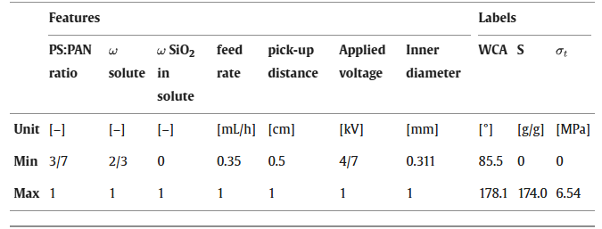
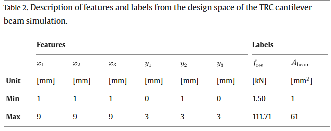

SIM-PAN 和 SIM-TRC 的 参数范围在论文中有

generate_json.py
用于生成训练用的参数空间的json

run_all_methods.py
使用所有方法预测下一轮特征值

export_round1_candidates.py
取生成的特征值导出为训练仿真用的csv文件

GP+US: Performance of uncertainty-based active learning for efficient approximation of black-box functions in materials science
GP+US: Benchmarking the acceleration of materials discovery by sequential learning
GP+US: Adaptive sampling assisted surrogate modeling of initial failure envelopes of composite structures
GP+US(BO for 最大预测目标): Machine-learning-assisted development and theoretical consideration for the Al2Fe3Si3 thermoelectric material
GP+US(BO for 最大预测目标): Designing nanostructures for phonon transport via bayesian optimization.

SVM（RBF核）+ GS/IGS: Exploring active learning strategies for predictive models in mechanics of materials
SVR + Enhanced Query-by-Committee : Applying enhanced active learning to predict formation energy
RF + XGB + QBC（Query-by-Committee）: Exploiting redundancy in large materials datasets for efficient machine learning with less data
NN + Query-by-Committee: Active learning and element-embedding approach in neural networks for infinite-layer versus perovskite oxides
QBC经典：Active Learning for Regression Based on Query by Committee

GBR+ Query-by-Committee(SVR（Support Vector Regression）+ GBR（Gradient Boosting Regression）+ FR（Random Forest Regression）+ ABR（AdaBoost Regression）+ KRR（Kernel Ridge Regression）): Active learning for the power factor prediction in diamond-like thermoelectric materials

接下来的工作：

0. 确定所有实验的参数范围。

    - Finite-Element-Analysis-of-Concrete-using-Python
        - 输入：
            - thk板厚 (100~250) 100 110 120 130 140 150 160 170 180 190 200 210 220 230 240 250 16个
            - 板长/板宽:[1.0 1.25 1.5 1.75 2.0 2.25] 6个
            - 板宽: [1000 1500 2000 2500 3000 3500 4000 4500 5000] 9个
            - E: 24000 26700 30100 32800 34800 37400 39600 42200 来源于Table 3.1.2  8个
            - ρ：2400 kg/m3 固定
            - LL: -1.5 -2.0 -2.5 -3.0 -3.5 -4.0 -5.0 7个
            - SDL -0 -0.25 -1.0 -1.25 -1.5 5个
        - 输出：
            - max|Uz|

    - SIM PAN参数范围：注意，参数是连续的
        
    - SIM TRC参数范围：注意，参数是离散的
        

1. 三个仿真分别生成一个示例性质的数据集，使用拉丁超立方scipy.stats.qmc.LatinHypercube进行采样。200个数据点。

2. 对照试验设计：

    pan仿真

    seed 40-50 10seed

    参数空间 每个维度10个样本

    测试集使用拉丁超立方采样100，采样之后要把100个删掉 

    初始采样 从(参数空间-100)中随机采样 5个 

    主动学习采样，每次采样 2个 采样20

要做的策略：

    autosklearn(RF) + treebased_representativity_self.py

    GP + US: ./src/GP_Active_learning.py

    XGB + qbc：XGB(超参数用qbc_paper.py中的xgb超参数) + ./src/strategies/qbc_paper.py

结果处理：
每个步骤包括初始采样和主动学习采样步骤，都会有Metric(R2,MAE,RMSE) 做10个seed的平均
画出来一个，plot，plot里有一个折线，X轴是数据集大小(采样次数) Y轴是 Metric。

autosklearn的脚本逻辑：
1. run_activelearning 获得 采样的(绝对)index。[[1,5,7,9,11],[52,26],[16,87]...]
python run_active_learning.py --random_state $index1

最后会有10个Json结果文件 名字seed_40 - seed_49
[[],[],[],[],.....]

还会产生parameter_space的csv文件 名字：{taskname}_{seed}_parameter_space.csv  包含所有的Xtrain。
还会有一个测试集的csv 名字：{taskname}_{seed}_test.csv  包含所有的Xtest+ytest。
最好结果文件都保存在特定的文件夹里，还要区分sim_name

2. 根据idx列表来运行仿真
比如 def(idx_list, seed, ):
        Parameter_space = pd.read_csv('{taskname}_{seed}_parameter_space.csv')
        .....
        结果：生成一个csv，{taskname}_{seed}_train.csv 里边包含 所有被选中的样本的 绝对idx，X_train，y_train。这样后边可以通过(绝对)index列表在这个文件中选择。
                csv里一定要有绝对idx的信息

3. run_automl 根据index获取训练集。模拟数据集越来越大，但是可以并行。
index2 = 0 1 2 3 ... 20
python run_automl.py --random_state $index1 --sampling_steps $index2

写了 .src\run_automl_trc.py 作为例子，不一定能跑通，但是逻辑差不多。你再检查一下

计算平台：超算，bash脚本的array功能，纯平行。

GP的话就可以放在一起搞了，采样+仿真+训练

